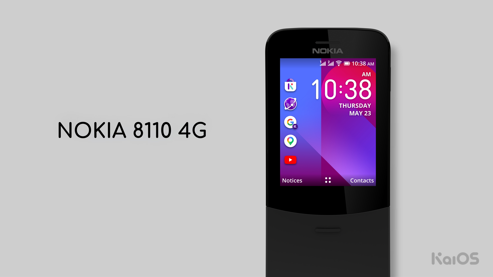
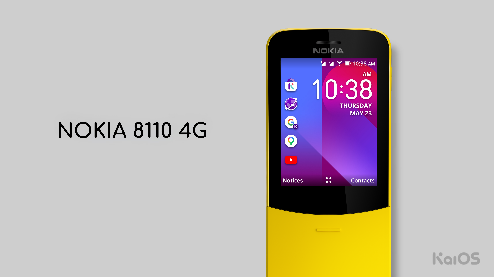
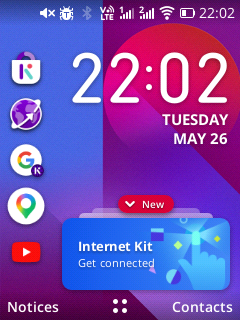
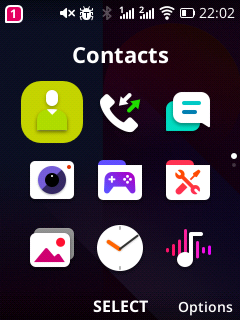
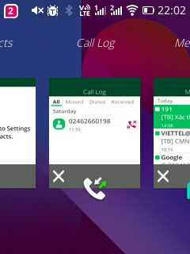

# KaiOS 2.5.4 for Nokia 8110 4G

  
  

A custom KaiOS 2.5.4 build for the Nokia 8110 4G (TA-1048 / TA-1059),
featuring numerous bug fixes, patches, and improvements over the stock firmware.

  
  
  

---

# Changelog

## Stable v5

**Bug fixes:** fix text overflow caused by unusual emoji.

### `Resources/System` changes

| File | Change |
|---|---|
| `fonts/TwemojiMozilla.ttf` | Add Twemoji emoji font (replaces Noto Color Emoji) |
| `fonts/NotoColorEmoji.ttf` | Removed (replaced by Twemoji) |
| `etc/fonts.xml` | Use `TwemojiMozilla.ttf` and add `KaiOSEmoji.ttf` as emoji fonts |
| `etc/fallback_fonts.xml` | Use `TwemojiMozilla.ttf` and add `KaiOSEmoji.ttf` as fallback emoji fonts |
| `b2g/webapps/system.gaiamobile.org/application.zip` | Add a "Clear all" button to the task manager |

## Stable v4

### `Resources/System` changes

| File | Change |
|---|---|
| `lib/libmtp.so` | Fix incorrect reported storage capacity (now shows the real size) |
| `b2g/webapps/webapps.json` | Set `preinstalled=true` instead of `sideloaded=true` for 4 apps |

## Stable v3

### `Resources/System` changes

| File | Change |
|---|---|
| `etc/volume.cfg` | Fix USB storage so it stays recognized when no SD card is present |
| `etc/init.qcom.post_boot.sh` | Add auto swap setup at boot |
| `kaios/` | Update to KaiOS 2.5.4 in sync with b2g |
| `media/bootanimation.zip` | Replace with an animated boot logo |
| `media/memorycleaneranimation.zip` | Add memory cleaner animation for `system.gaiamobile.org` |
| `build.prop` | Adjust build, OS and related properties to match b2g |
| `xbin/` | Sync binaries with Philz Touch recovery |
| `lib/libmtp.so` | Fix USB storage being reported as fixed storage (100001, 200001) |
| `lib/modules/wlan.ko` | Removed (no longer needed) |
| `b2g/omni.ja` | Fix vibrator |
| `b2g/libxul.so` | Fix USB storage not being detected when enabled but plugged in |
| `b2g/defaults/settings.json` | Change default wallpaper and default incoming call ringtone |
| `b2g/webapps/clock.gaiamobile.org/application.zip` | Remove Nokia stock ringtone |
| `b2g/webapps/settings.gaiamobile.org/application.zip` | Add SELinux status, Phone Status, and battery percentage on the status bar |
| `b2g/webapps/system.gaiamobile.org/application.zip` | Add function to show battery percentage on the status bar when toggled in Settings |

---

If you encounter any issues, please contact us at: https://supportkaiostech.slack.com
